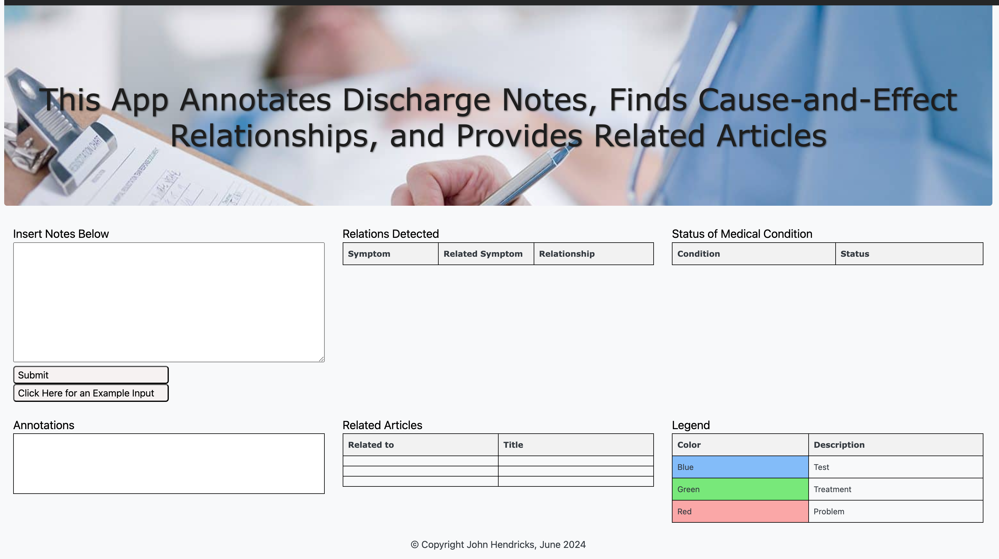
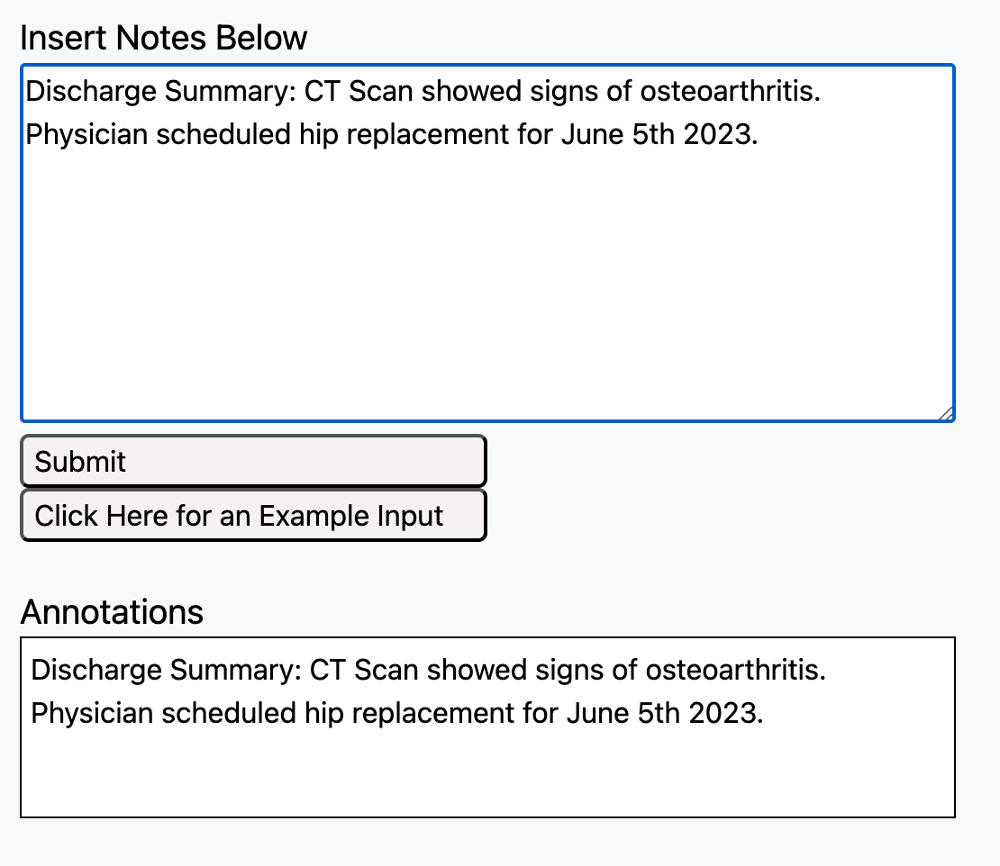
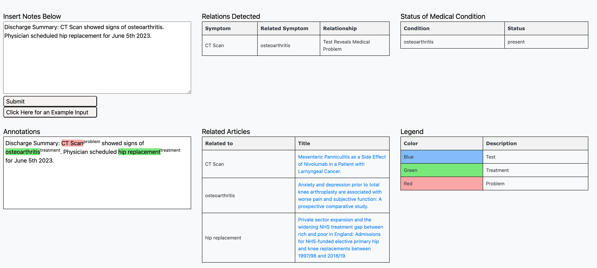

# Clinical Discharge Notes Annotator

## Table of Contents

- [Introduction](#introduction)
- [Features](#features)
- [Installation](#installation)
- [Usage](#usage)
- [Screenshots](#screenshots)
- [Contributing](#contributing)
- [License](#license)
- [Contact](#contact)

## Introduction

The **Clinical Discharge Notes Annotator** is an application designed to annotate clinical discharge notes, identify relationships between annotations, find related scholarly articles,and determine the status of medical conditions as absent, present, and conditional. This tool aims to assist healthcare professionals in efficiently managing and understanding patient information.

Each language model (3 in total) was trained on data from the 2010 Concept, Assertion, and Relation Challenge by i2b2 ([find datasets here](https://portal.dbmi.hms.harvard.edu/projects/n2c2-nlp/)). Two SciBERT models were separately fine-tuned on this data for enabling the annotation and medical status functionality. The language model LUKE was fine-tuned on this data to perform the relation-detection functionality.

## Features

- Annotate clinical discharge notes with ease.
- Identify relationships between different annotations.
- Determine the status of medical conditions (absent, present, conditional).
- User-friendly interface.
- High accuracy and performance.

## Installation

To get started with the Clinical Discharge Notes Annotator, follow these steps:

1. **Clone the repository:**
    ```sh
    git clone https://github.com/yourusername/your-repo.git
    cd your-repo
    ```

2. **Install dependencies:**
    ```sh
    pip install -r requirements.txt
    ```

3. **Run the application:**
    ```sh
    python app.py
    ```

## Usage

To use the application, follow these steps:

1. Launch the application by running `python app.py`.
2. Upload the clinical discharge notes you wish to annotate.
3. Use the annotation tools to highlight and label the relevant sections.
4. The application will automatically find relationships between annotations and determine the status of medical conditions.
5. Save or export the annotated notes for further use.

## Screenshots

### Web Application Upon Loading


### Input Discharge Notes in the Upper Text Box, Then Click "Submit"


### Output Will Include: Highlighted Concepts, Cause-Effect Relationships Among Concepts, Presense/Absense of Medical Conditions, and Related Articles


## Contributing

We welcome contributions from the community! To contribute:

1. Fork the repository.
2. Create a new branch (`git checkout -b feature/YourFeature`).
3. Make your changes.
4. Commit your changes (`git commit -m 'Add your feature'`).
5. Push to the branch (`git push origin feature/YourFeature`).
6. Open a Pull Request.

## Contact

For any questions or inquiries, please contact:

- **John Hendricks**
- **Email:** john.hendricks4@gmail.com
- **GitHub:** [j-hendricks](https://github.com/j-hendricks)
